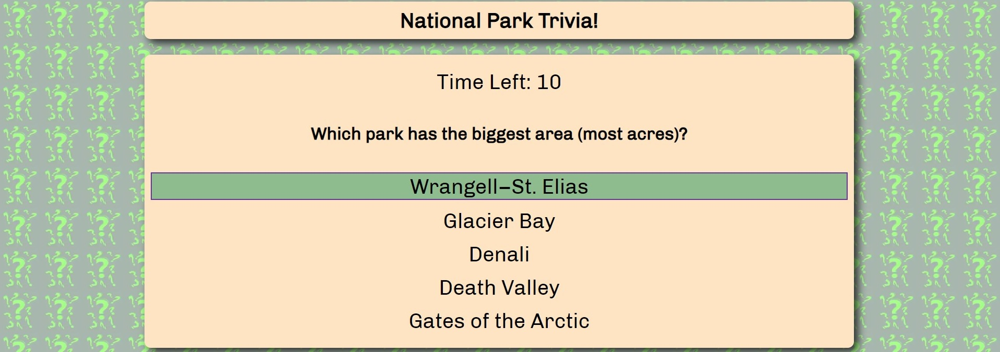
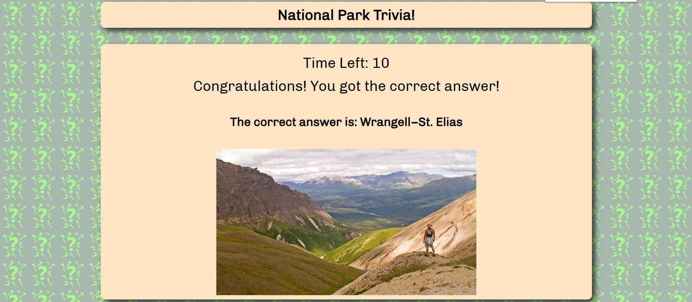
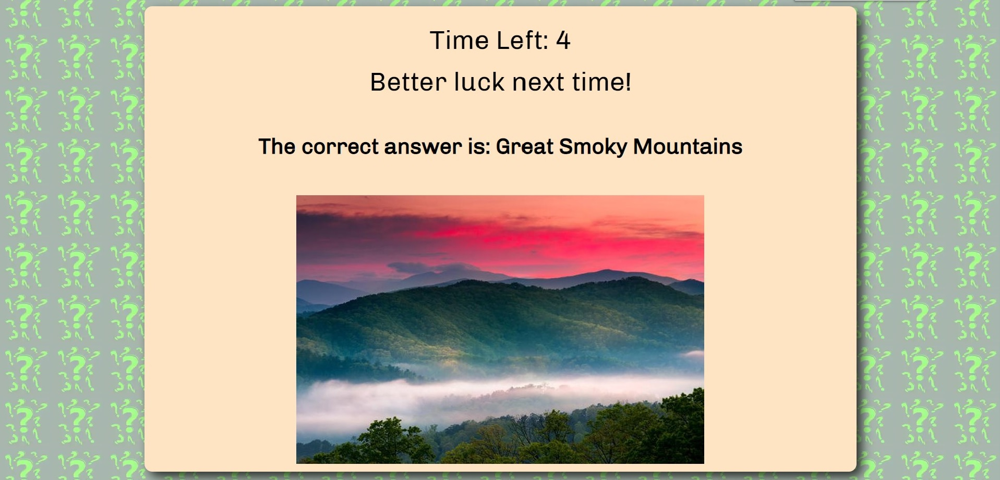
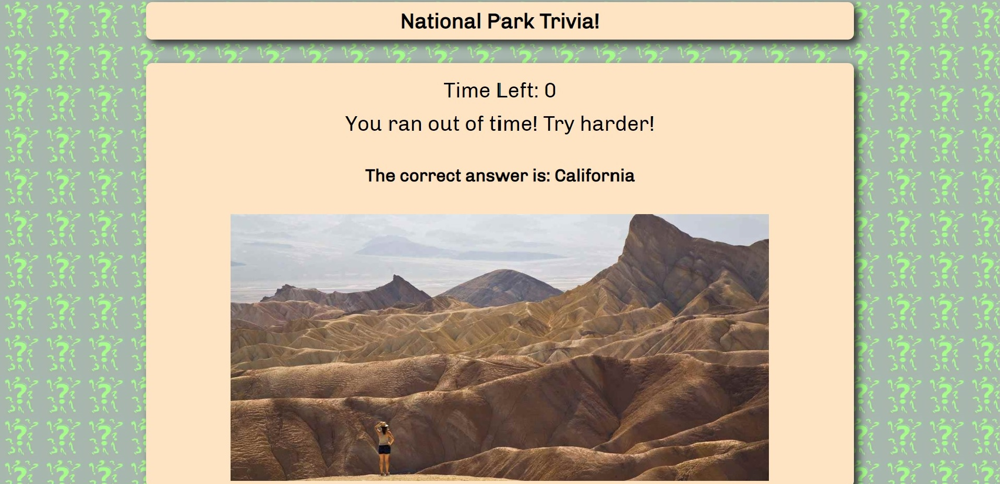
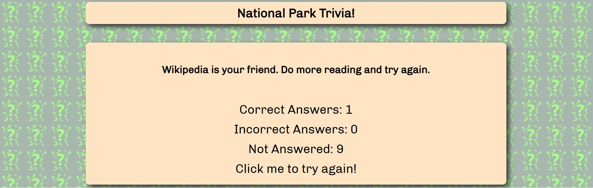

# National Park Trivia

## Overview
National Park Trivia is a web based Javascript game where users answer questions related to the national parks in the United States. It allows the users to answer each question within a limited time period and presents the correct answer once answered. It also calculates and displays the final score once the game is complete. Once complete, users get ‘Congratulations’, ‘Better luck next time’, and other fun messages based on the number of questions they answered correctly.

Technologies: jQuery, Javascript, Intervals, Timers

## Deployed Link

https://peterwra.github.io/TriviaGame/

## Views

Let's start the trivia! Fifteen seconds for each question! Click on the 'Start Trivia Game!' button to begin!

You will be presented with multiple answers. Select the correct one! Remember, you only have 15 seconds!

Timer will count down to zero.

You got the correct answer!

If you don't get the correct answer...

There is a total of 15 seconds for each question. Once 5 seconds left are reached, the timer will start to flash red. Once it reaches zero, the results will be displayed for the question.

At the end your score will be displayed and you will be asked if you want to try again.

